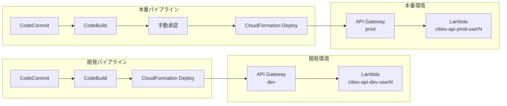
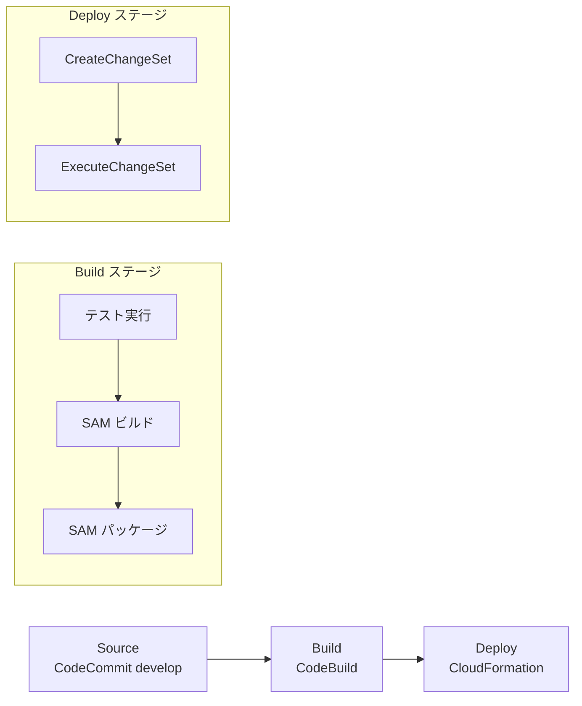
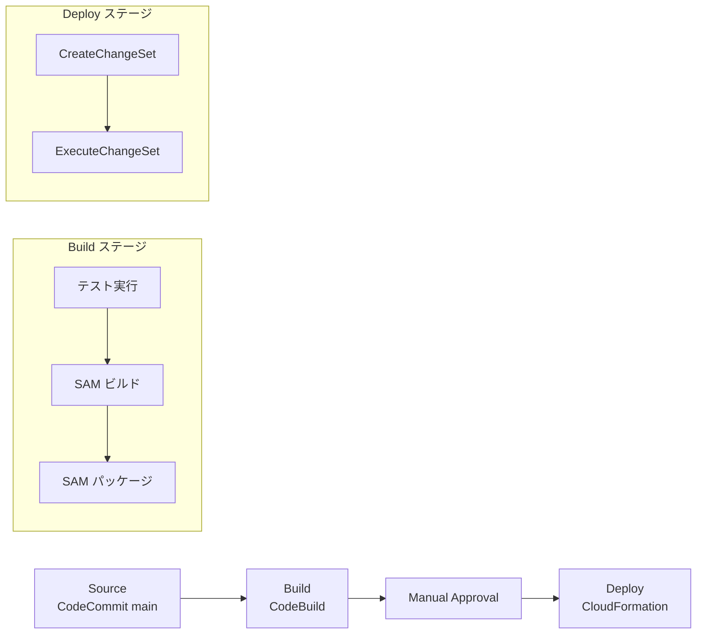

# DESIGN.md — システム設計書

## 機能設計

### システムアーキテクチャ



### パイプライン詳細設計

#### 開発パイプライン



#### 本番パイプライン



### コンポーネント設計

| コンポーネント | 役割 | 備考 |
|---|---|---|
| Lambda関数 | 都市情報APIのリクエスト処理 | Python 3.12ランタイム |
| API Gateway | HTTPエンドポイントの公開 | REST API |
| CodeCommit | ソースコード管理 | develop / main ブランチ |
| CodeBuild | テスト実行、SAMビルド・パッケージ | 環境ごとに1プロジェクト（計2つ） |
| CodePipeline | パイプラインのオーケストレーション | 開発用・本番用の2本 |
| S3 | SAMデプロイ用アーティファクト格納 | sam package の出力先 |
| CloudFormation | インフラのデプロイ | SAMテンプレートを実行 |

### API設計

#### GET /cities

都市一覧を取得する。

- リクエスト：パラメータなし
- レスポンス：200 OK

```json
{
  "cities": [
    {
      "city_id": "tokyo",
      "name": "東京",
      "population": 14000000,
      "region": "関東"
    }
  ]
}
```

#### GET /cities/{city_id}

指定した都市の情報を取得する。

- リクエスト：パスパラメータ `city_id`（例：`tokyo`）
- レスポンス（正常）：200 OK

```json
{
  "city_id": "tokyo",
  "name": "東京",
  "population": 14000000,
  "region": "関東"
}
```

- レスポンス（都市が存在しない場合）：404 Not Found

```json
{
  "error": "City not found",
  "city_id": "unknown"
}
```

### 都市データ一覧

| city_id | name | population | region |
|---|---|---|---|
| tokyo | 東京 | 14000000 | 関東 |
| osaka | 大阪 | 8800000 | 近畿 |
| nagoya | 名古屋 | 2300000 | 中部 |
| fukuoka | 福岡 | 1600000 | 九州 |
| sapporo | 札幌 | 1970000 | 北海道 |

## 技術仕様

### テクノロジースタック

| カテゴリ | 技術 | バージョン |
|---|---|---|
| 言語 | Python | 3.12 |
| IaCフレームワーク | AWS SAM | 最新 |
| テストフレームワーク | pytest | 最新 |
| CI/CDサービス | CodeCommit / CodeBuild / CodePipeline | - |
| ランタイム | API Gateway + Lambda | - |

### 開発ツールと手法

| ツール | 用途 |
|---|---|
| AWS SAM CLI | ローカル開発・ビルド・デプロイ |
| pytest | ユニットテスト実行 |
| AWS マネジメントコンソール | パイプライン構築（ハンズオン） |

### SAMテンプレート設計

- 環境分離はパラメータ `Environment`（dev / prod）で制御する
- リソース名に Environment を付与して開発・本番を分離する
- 複数ユーザー共存のためパラメータ `UserName` を持ち、リソース名の末尾にサフィックスとして付与する

### リソース命名規約

同一AWSアカウント・同一リージョンで複数ユーザーが共存できるよう、リソース名の末尾に `<UserName>` をサフィックスとして付ける。`Environment`（dev/prod）サフィックスがある場合は、`<Environment>` の後ろに `<UserName>` を置く。

#### setup.yaml が作るリソース

| リソース | 命名 |
|---|---|
| CodeCommit リポジトリ | `cities-api-<UserName>` |
| S3 バケット | `cities-api-artifacts-<Acct>-<Region>-<UserName>` |
| build-role | `cities-api-build-role-<UserName>` |
| pipeline-role | `cities-api-pipeline-role-<UserName>` |
| deploy-role | `cities-api-deploy-role-<UserName>` |

#### template.yaml が作るリソース

| リソース | 命名 |
|---|---|
| API Gateway | `cities-api-<Environment>-<UserName>` |
| ListCities Lambda | `cities-list-<Environment>-<UserName>` |
| GetCity Lambda | `cities-get-<Environment>-<UserName>` |

#### 受講者が手で命名するリソース

| リソース | 命名 |
|---|---|
| 事前構築 CFN スタック | `cities-api-setup-<UserName>` |
| CodeBuild プロジェクト | `cities-api-build-<Environment>-<UserName>` |
| CodePipeline | `cities-api-pipeline-<Environment>-<UserName>` |
| デプロイ先 CFN スタック | `cities-api-<Environment>-<UserName>` |

#### UserName の制約

- 英小文字＋数字のみ（`^[a-z0-9]+$`）
- 1〜8 文字
- S3 バケット名のグローバル一意制約に合わせた文字種、および IAM ロール名 64 文字制限のマージン確保のための長さ制限

### buildspec.yml 設計

CodeBuildの処理は以下の3フェーズで構成する：

| フェーズ | 責務 |
|---|---|
| install | Pythonランタイムの指定 |
| pre_build | テスト用依存パッケージのインストール、ユニットテストの実行 |
| build | SAMビルド、SAMパッケージ（アーティファクトをS3に出力） |

- ビルド成果物として、パッケージ済みテンプレートをアーティファクトに含める
- `S3_BUCKET` 環境変数は受講者がCodeBuildプロジェクト作成時に設定する
- 受講者には骨格（フェーズ構造とコメントのみ）を提供し、手順書を見ながらコマンドを写経して完成させる

### ユニットテスト設計

| No. | テストケース | 検証内容 |
|---|---|---|
| 1 | 都市一覧取得 | GET /cities で200が返り、レスポンスに `cities` 配列が含まれる |
| 2 | 個別都市取得（正常） | GET /cities/tokyo で200が返り、`city_id` が `tokyo` である |
| 3 | 個別都市取得（異常） | GET /cities/unknown で404が返り、エラーメッセージが含まれる |

## 事前構築リソース設計

ハンズオン開始前に構築済みとするリソース：

| リソース | 用途 | 設計方針 |
|---|---|---|
| CodeCommitリポジトリ | ソースコード管理 | アプリコード・テスト・buildspec骨格をpush済み |
| S3バケット | SAMアーティファクト格納 | パイプラインからのアーティファクト出力先 |
| build-role（IAM） | CodeBuildの実行権限 | S3読み書き、CloudWatch Logs書き込み |
| pipeline-role（IAM） | パイプラインの実行権限 | CodeCommit読み取り、CodeBuild起動、S3読み書き、CloudFormation操作、deploy-role への PassRole |
| deploy-role（IAM） | デプロイの実行権限 | Lambda / API Gateway リソース作成・更新、SAMが動的生成するLambda実行ロールのIAM操作（個別アクション列挙） |

事前構築リソースはCloudFormationテンプレートで一括作成し、受講者が手動で作成する必要がないようにする。

## リポジトリ構造定義書

```
ci_cd_workshop/
├── README.md                    # ワークショップ概要
├── CLAUDE.md                    # プロジェクトルール（Claude Codeが自動読み込み）
├── template.yaml                # SAMテンプレート
├── buildspec.yml                # CodeBuild用（骨格版、受講者が完成させる）
├── buildspec_complete.yml       # CodeBuild用（完成版、講師用参考）
├── setup/
│   └── setup.yaml              # 事前構築用CloudFormationテンプレート
├── src/
│   └── cities/
│       ├── __init__.py
│       ├── app.py              # Lambdaハンドラー
│       └── data.py             # 都市データ定義
├── tests/
│   ├── requirements.txt        # テスト用依存パッケージ（pytest）
│   └── test_cities.py          # ユニットテスト
├── docs/                       # プロジェクト製作者向けドキュメント
│   ├── SPEC.md                 # 仕様書
│   ├── DESIGN.md               # 設計書
│   ├── TASKS.md                # タスク管理
│   └── LOGS.md                 # 作業ログ
├── handson/                    # ワークショップ受講者向けコンテンツ
│   ├── README.md               # ハンズオン全体ガイド・目次
│   ├── step1.md                # Step 1 手順書
│   ├── step2.md                # Step 2 手順書
│   ├── step3.md                # Step 3 手順書
│   ├── step4.md                # Step 4 手順書
│   ├── step5.md                # Step 5 手順書
│   └── cleanup.md              # ハンズオン後のクリーンアップ手順
└── steering/
    ├── steering-t1-sam-app.md  # T1のステアリングファイル
    └── ...                     # T2〜T5のステアリングファイル
```

### ディレクトリの役割

| ディレクトリ | 役割 |
|---|---|
| `src/cities/` | Lambdaアプリケーションコード |
| `tests/` | ユニットテスト |
| `setup/` | 事前構築用CloudFormationテンプレート |
| `docs/` | プロジェクト製作者向けドキュメント（仕様・設計・タスク・ログ） |
| `handson/` | ワークショップ受講者向けコンテンツ（ハンズオン手順書） |
| `steering/` | タスクごとのステアリングファイル |

### ファイル配置ルール

- Lambdaのソースコードは `src/{関数名}/` 配下に配置
- テストは `tests/` 直下に `test_` プレフィックスで配置
- SAMテンプレートはリポジトリルートに配置
- 手順書は `handson/` に Step 番号で配置
- 仕様書・設計書・タスク管理・作業ログは `docs/` 直下に配置
- 個別タスクのステアリングファイルは `steering/` 配下に配置
- CLAUDE.md だけは Claude Code が自動読み込みする都合上、リポジトリルートに配置
